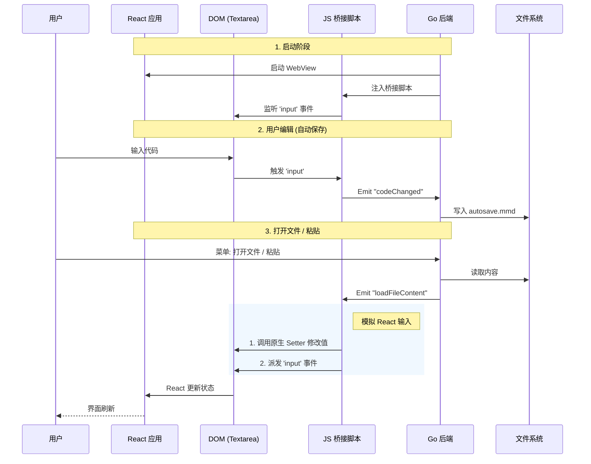

# Wails 桌面应用架构设计文档

本文档详细描述了 Modern Mermaid Desktop 的技术架构、数据流设计及关键实现细节。

## 1. 核心设计理念

**"零侵入" (Zero-Intrusion)** 是本项目的核心架构原则。

*   **现状**：我们拥有一个成熟的 React Web 项目，位于项目根目录。
*   **目标**：将其封装为桌面应用，提供本地文件读写、剪贴板交互等原生能力。
*   **约束**：不得修改 Web 项目的源码 (`src/`)，确保 Web 版和桌面版共用同一套代码库，且能无痛同步上游更新。

## 2. 目录结构设计

采用 **"子目录挂载"** 模式：

```text
modern_mermaid/          <-- 根目录 (Web 项目)
├── package.json         <-- Web 依赖
├── src/                 <-- Web 源码 (React)
├── index.html           <-- Web 入口
├── dist/                <-- Web 构建产物
└── desktop/             <-- 桌面端源码 (Wails)
    ├── go.mod
    ├── main.go          <-- Wails 入口 & 系统菜单
    ├── app.go           <-- 核心逻辑 & JS 桥接
    ├── wails.json       <-- Wails 配置
    └── assets/          <-- 嵌入资源 (构建后的 dist 副本)
```

## 3. 系统架构与数据流

### 3.1 架构概览

Wails 应用作为一个宿主容器，通过 WebView 加载 Web 资源。由于无法修改 React 代码来主动调用 Go 方法，我们采用 **"运行时注入 (Runtime Injection)"** 技术，通过 DOM 事件进行隐式通信。

```mermaid
graph TB
    subgraph Root["项目根目录 (modern_mermaid)"]
        WebSrc[("Web Source\n(src/, index.html)")]
        BuildDist["构建产物\n(dist/)"]
        
        subgraph DesktopDir["desktop/ (New)"]
            WailsConfig["wails.json\n(frontend: ../)"]
            GoMain["main.go\n(Wails App)"]
            GoApp["app.go\n(逻辑 & 桥接)"]
        end
    end

    subgraph Runtime["运行时进程"]
        GoRuntime["Go 运行时\n(系统菜单 / 文件 IO)"]
        WebView["WebView (WebKit/WebView2)"]
    end

    %% 关系
    WebSrc -- "Vite Build" --> BuildDist
    WailsConfig -- "指向" --> WebSrc
    WailsConfig -- "嵌入" --> BuildDist
    
    GoMain -- "启动" --> GoRuntime
    GoRuntime -- "宿主" --> WebView
    BuildDist -- "加载者" --> WebView
    
    GoApp -- "1. 注入脚本" .-> WebView
    GoApp -- "2. 监听/保存" --> LocalFS[("本地文件系统\n(.mmd 文件)")]

    style WebSrc fill:#e1f5fe,stroke:#01579b
    style GoApp fill:#e8f5e9,stroke:#1b5e20
    style DesktopDir fill:#fff3e0,stroke:#e65100,stroke-dasharray: 5 5
```

### 3.2 交互流程详解

#### A. 启动与注入
1.  Wails 应用启动。
2.  WebView 加载页面。
3.  Go 后端通过 `OnDomReady` 钩子，向页面注入一段 JavaScript 桥接脚本。
4.  桥接脚本使用 `MutationObserver` 等待 React 渲染出核心的 `<textarea>` 组件。
5.  一旦找到，脚本立即绑定 `input` 事件监听器。

#### B. 数据同步 (Web -> Go)
当用户在编辑器中输入时：
1.  用户输入触发 DOM 的 `input` 事件。
2.  注入的桥接脚本捕获该事件，提取 `target.value`。
3.  脚本调用 `window.runtime.EventsEmit("codeChanged", content)`。
4.  Go 后端的 `app.go` 收到事件，将内容写入本地文件 (`autosave.mmd`)。

#### C. 数据加载 (Go -> Web)
当用户打开文件或从剪贴板粘贴时：
1.  Go 读取文件内容或剪贴板文本。
2.  Go 调用 `runtime.EventsEmit(ctx, "loadFileContent", content)`。
3.  前端桥接脚本收到事件。
4.  **关键黑魔法**：脚本通过 `Object.getOwnPropertyDescriptor` 获取原生 `HTMLTextAreaElement` 的值设置器 (Value Setter)，直接更新 `<textarea>` 的值，并手动派发 `input` 事件。
5.  React 侦测到 DOM 变化，更新组件状态 (State)，从而刷新 UI。



## 4. 功能实现细节

### 4.1 自动保存 (Auto-Save)
*   **路径**：用户配置目录下的 `modern-mermaid/autosave.mmd`。
    *   MacOS: `~/Library/Application Support/modern-mermaid/autosave.mmd`
    *   Windows: `%APPDATA%\modern-mermaid\autosave.mmd`
*   **机制**：每次按键触发保存（依赖操作系统的文件缓存优化）。启动时自动读取。

### 4.2 剪贴板集成
*   **读取**：Go 使用 `runtime.ClipboardGetText()` 读取系统剪切板。
*   **写入**：通过上述的“数据加载”流程，将文本插入到光标位置（如果支持）或替换内容。
*   **菜单**：在系统菜单栏添加 "Edit -> Paste" 项，绑定到 Go 的 `PasteFromClipboard` 方法。

### 4.3 配置持久化 (Configuration Persistence)

为了解决 React 前端依赖 URL 参数存储状态（如主题、背景、字体）在桌面端应用重启后丢失的问题，我们实现了 **配置同步与恢复机制**。

#### A. 状态监听 (Frontend -> Go)
*   **Polling (轮询)**: 注入的 JS 脚本每秒检查一次 `window.location.search`。
*   **Monkey Patch**: 同时也拦截了 `history.pushState` 和 `history.replaceState` 以实现即时响应。
*   当 URL 参数变化时，JS 提取 `theme`, `bg`, `font`, `lang` 参数，并通过 `window.runtime.EventsEmit("configChanged", config)` 发送给 Go 后端。
*   Go 后端将配置序列化保存到 `config.json`。

#### B. 状态注入 (Go -> Frontend)
*   **Asset Middleware**: 在 `desktop/main.go` 中，我们使用 Wails 的 `AssetServer.Middleware` 拦截对 `index.html` 的请求。
*   **Startup Injection**: 
    1.  Go 端在内存中维护最新的配置（从 `config.json` 读取）。
    2.  在服务 `index.html` 前，Go 动态生成一段 `<script>` 代码。
    3.  该脚本包含 `localStorage.setItem('darkMode', ...)` 和 `window.history.replaceState(..., '/?theme=...')`。
    4.  脚本被注入到 `<head>` 的最前面。
*   **结果**: 当 React 应用加载并初始化时，它能立即从 URL 和 LocalStorage 中读取到正确的配置，从而恢复用户上次的状态，无需任何刷新或闪烁。

#### C. Service Worker 兼容性
*   由于 Wails 使用自定义协议 (`wails://`)，Service Worker 无法正常工作并会报错。
*   我们通过环境变量 `VITE_IS_DESKTOP=true` 在构建阶段（`vite.config.ts`）完全禁用了 PWA 插件，确保桌面版生成的 `index.html` 不包含任何 SW 注册代码。

## 5. 开发与构建

### 开发模式
```bash
cd desktop
wails dev
```
Wails 将启动 Go 后端，并自动运行 `pnpm dev` 启动前端服务器。

### 生产构建
```bash
cd desktop
wails build
```
Wails 将：
1.  调用 `pnpm build` 构建 React 项目到 `dist/`。
2.  将 `dist/` 复制到 `desktop/assets/`。
3.  编译 Go 代码并将资源嵌入二进制文件。
