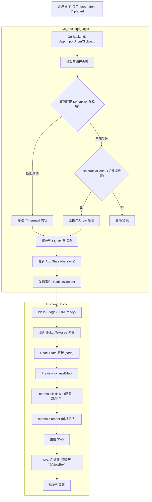

# 剪切板读取与解析逻辑详解

本文档详细分析了 Modern Mermaid Desktop 如何从系统剪切板读取内容、识别 Mermaid 代码并进行渲染的完整流程。

## 1. 核心流程概览

整个过程跨越了 Go 后端 (Wails) 和 React 前端：

1.  **Go 后端**: 负责与操作系统剪切板交互，读取文本，并执行智能提取（区分 Markdown 代码块和纯代码）。
2.  **React 前端**: 接收提取后的 Mermaid 代码，使用 `mermaid.js` 库进行词法解析和图形渲染。

## 2. 代码实现细节

### 2.1 后端：读取与提取 (Desktop/Go)

核心逻辑位于 `desktop/app.go` 文件中。

#### A. 触发入口
主要通过 `ImportFromClipboard` 方法触发（通常由菜单项调用）。

#### B. 提取策略
应用采用两级提取策略，确保能处理多种格式的剪切板内容：

1.  **Markdown 代码块匹配 (优先)**
    *   **代码位置**: `ImportFromClipboard` 方法
    *   **逻辑**: 使用正则表达式 `(?s)```mermaid\s*(.*?)``` `。
    *   **作用**: 允许用户直接复制 GitHub issue 或 Markdown 文档中的整个代码块，应用会自动提取出反引号内部的 Mermaid 代码。
    *   **多图支持**: 如果剪切板中包含多个 `mermaid` 代码块，应用会**一次性全部提取**，将它们保存为多条记录，并默认显示提取到的第一个图表。用户可以通过界面下方的导航按钮在这些图表间切换。

2.  **纯代码关键词检测 (回退)**
    *   **代码位置**: `isMermaidCode` 方法
    *   **逻辑**: 如果正则匹配失败，应用会逐行扫描文本。
    *   **规则**: 忽略空行和注释 (`%%`)，检查第一行有效代码是否以 Mermaid 关键字开头（如 `graph`, `flowchart`, `sequenceDiagram` 等）。

#### C. 数据分发
提取成功后，后端会执行以下操作：
1.  **持久化**: 调用 `dbInsertDiagram` 将代码保存到 SQLite 数据库。
2.  **状态更新**: 更新内存中的 `diagrams` 列表。
3.  **事件广播**: 通过 `runtime.EventsEmit(ctx, "loadFileContent", content)` 通知前端加载新内容。

### 2.2 前端：接收与渲染 (Frontend/React)

核心逻辑位于 `src/components/Preview.tsx` 和 `src/components/Editor.tsx`。

#### A. 接收数据
*   Wails Bridge (注入的 JS) 监听到 `loadFileContent` 事件。
*   自动更新隐藏的 `textarea` 值并触发 React 的状态更新。

#### B. 解析与渲染 (`Preview.tsx`)
一旦 React 状态 (`code`) 更新，`Preview` 组件的 `useEffect` 钩子被触发：

1.  **初始化**: 调用 `mermaid.initialize` 配置主题、字体和安全级别。
2.  **解析**: 调用 `await mermaid.render(id, code)`。
    *   这是 **解析 (Parsing)** 发生的具体位置。`mermaid.js` 库会对文本进行词法分析，构建图形定义。
    *   如果语法错误，`mermaid.render` 会抛出异常（我们在 UI 上捕获并显示错误信息）。
3.  **SVG 生成**: 解析成功后，`mermaid.render` 返回 SVG 字符串。
4.  **后处理**: 代码对返回的 SVG 进行正则替换，移除固定的 `width/height="100%"` 属性，确保 SVG 能在容器中正确缩放。

## 3. 逻辑流程图

> 注意：为了避免 Mermaid 解析错误，图中所有节点文本均已规范化处理（使用双引号包裹）。



## 4. 相关文件引用

*   **读取与提取**: `desktop/app.go`
*   **渲染逻辑**: `src/components/Preview.tsx`
*   **桥接逻辑**: `desktop/app.go` (内嵌 JS)
