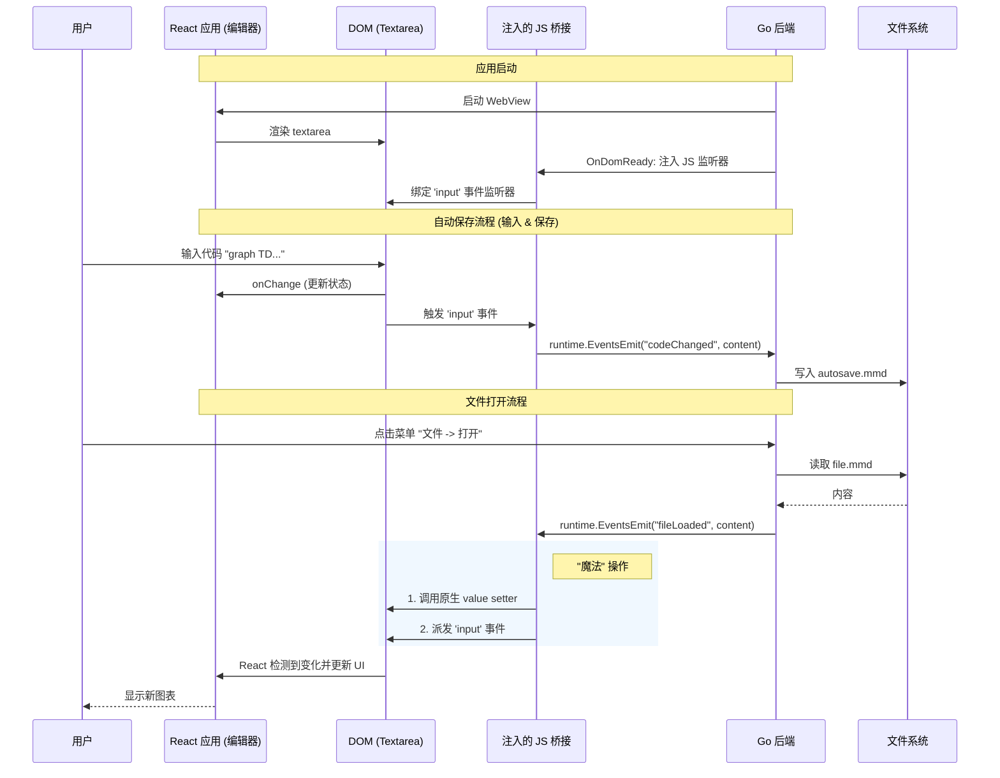

# Wails 桌面应用迁移方案

本文档概述了将 Modern Mermaid Web 应用转换为基于 [Wails](https://wails.io/) 的原生桌面应用的架构和实施计划。

## 1. 设计理念：零侵入 (Zero-Intrusion)

本次迁移的核心原则是 **零侵入**。我们的目标是在不修改现有 React 源代码 (`src/`) 或配置文件 (`package.json`, `vite.config.ts`) 的前提下，包装现有的应用。

这样可以确保：
- **无缝更新**：您可以随时拉取上游开源仓库的更新，而不会发生冲突。
- **清晰分离**：所有桌面端特定的逻辑都完全驻留在独立的 `desktop/` 目录中。
- **双模运行**：项目依然可以作为标准的 Web 应用进行部署。

## 2. 系统架构

Wails 应用充当宿主，嵌入从项目根目录构建的 Web 资源。它通过运行时脚本注入与 Web 视图进行交互。

```mermaid
graph TB
    subgraph Root["项目根目录 (modern_mermaid)"]
        WebSrc[("Web 源码\n(src/, index.html)")]
        BuildDist["构建产物\n(dist/)"]
        
        subgraph DesktopDir["desktop/ (新增)"]
            WailsConfig["wails.json\n(frontend: ../)"]
            GoMain["main.go\n(Wails App)"]
            GoApp["app.go\n(逻辑 & 桥接)"]
        end
    end

    subgraph Runtime["运行时进程"]
        GoRuntime["Go 运行时\n(系统菜单 / 文件 IO)"]
        WebView["WebView (WebKit/WebView2)"]
    end

    %% 关系
    WebSrc -- "Vite Build" --> BuildDist
    WailsConfig -- "指向" --> WebSrc
    WailsConfig -- "嵌入" --> BuildDist
    
    GoMain -- "启动" --> GoRuntime
    GoRuntime -- "宿主" --> WebView
    BuildDist -- "加载者" --> WebView
    
    GoApp -- "1. 注入脚本" .-> WebView
    GoApp -- "2. 监听/保存" --> LocalFS[("本地文件系统\n(.mmd 文件)")]

    style WebSrc fill:#e1f5fe,stroke:#01579b
    style GoApp fill:#e8f5e9,stroke:#1b5e20
    style DesktopDir fill:#fff3e0,stroke:#e65100,stroke-dasharray: 5 5
```

## 3. 数据流与状态管理

由于我们不能修改 React 组件来暴露状态，我们依赖 **DOM 事件模拟** 来连接 Go 后端和 React 前端。



## 4. 实施步骤

### 步骤 1: 目录设置
在项目根目录下创建一个 `desktop/` 目录。该目录将包含所有 Wails 相关的代码。

### 步骤 2: Wails 配置 (`desktop/wails.json`)
配置 Wails 以在父目录 (`../`) 中查找前端代码。

```json
{
  "name": "Modern Mermaid Desktop",
  "frontend:install": "pnpm install",
  "frontend:build": "pnpm build",
  "frontend:dir": "../",
  "output:filename": "modern-mermaid"
}
```

### 步骤 3: 后端逻辑 (`desktop/app.go`)
实现 `App` 结构体，包含以下方法：
1.  **注入 JavaScript**: 在应用启动 (`OnDomReady`) 时，注入一个脚本来监听 `textarea` 的输入事件。
2.  **保存状态**: 监听来自 JS 的 `codeChanged` 事件，并写入 `~/.config/modern-mermaid/autosave.mmd`。
3.  **加载状态**: 启动时读取自动保存文件，并向 JS 发射 `fileLoaded` 事件。

### 步骤 4: 系统菜单 (`desktop/main.go`)
配置原生系统菜单（macOS/Windows），如“文件 -> 打开”、“文件 -> 保存”等，并将其链接到 App 的方法。

## 5. 存储策略

- **自动保存**：自动保存到用户的配置目录 (`AppUserData`)，防止数据丢失。
- **文件操作**：使用标准的文件打开/保存对话框来管理 `.mmd` 文件。

## 6. 已实现功能与变更记录 (Implemented Features & Changes)

### 2025-12-17
- **构建系统优化**: 引入 `Makefile` 统一管理构建命令，解决了命令行参数解析错误和路径问题。
- **窗口管理**: 
  - 启用了 macOS 风格的隐藏标题栏 (`TitleBarHiddenInset`)。
  - 在 `src/components/Header.tsx` 中实现了 `--wails-draggable` 区域，支持窗口拖动。
  - 设置应用启动时自动最大化窗口 (`WindowStartState: options.Maximised`)。
- **剪贴板集成**: 
  - 修复了 macOS 下复制图片失败的问题，采用 `Promise` + `ClipboardItem` 模式以满足 WebKit 安全上下文要求。
- **文件导出**: 
  - 实现了 `App.SaveImage` Go 方法，支持调用系统原生的保存文件对话框。
  - 修改了 `Preview.tsx`，在桌面环境下自动切换为系统保存对话框，在 Web 环境下保持浏览器下载行为。
- **多图浏览支持**:
  - 在系统菜单中添加了 "File -> Import from Clipboard" 功能，支持从剪贴板 Markdown 文本中提取多个 Mermaid 代码块。
  - 添加了动态的图表状态菜单（直接在菜单栏显示如 "Diagram: 1/5"），点击可展开 "Previous/Next" 导航选项。
  - 支持直接打开 `.md` 文件并自动提取其中的 Mermaid 图表。
  - **编辑同步**: 在编辑器中修改代码时，会自动同步更新内存中的图表列表。切换到其他图表再切换回来时，修改内容会保留。
- **缩放功能**:
  - 添加了 `View` 菜单，支持 "Zoom In" (Cmd++), "Zoom Out" (Cmd+-), "Reset Zoom" (Cmd+0)。
  - 通过 CSS `document.body.style.zoom` 实现全局界面缩放。
- **配置持久化**:
  - 缩放比例现在会保存到 `config.json`，下次启动自动应用。
